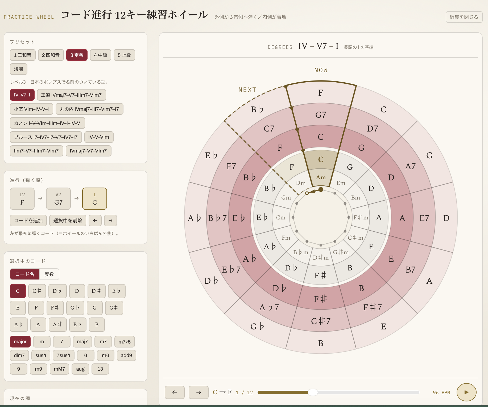
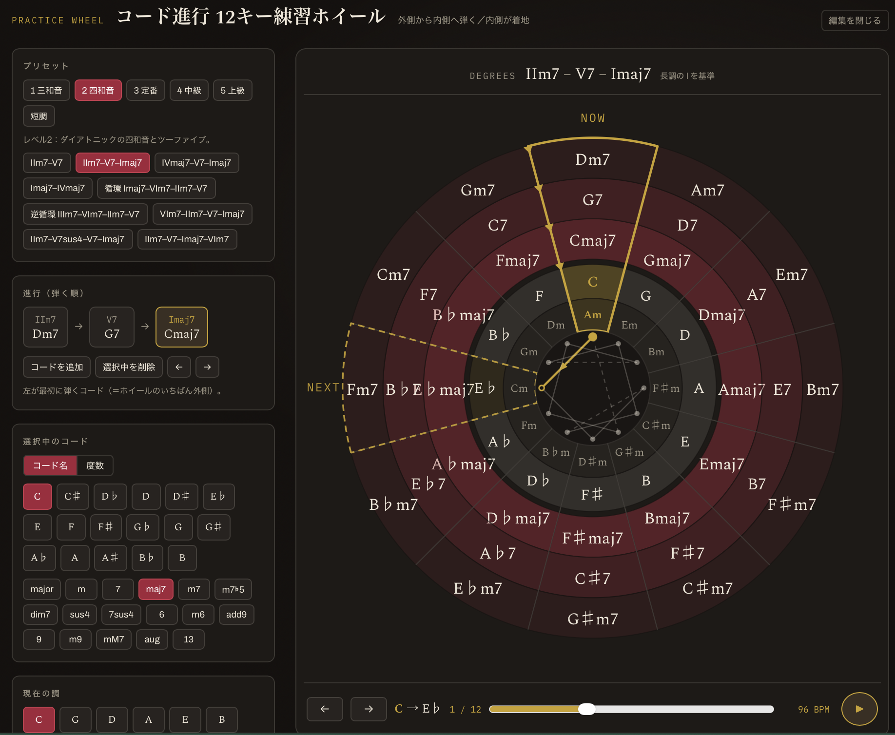

# コード進行 12キー練習ホイール

ピアノでコード進行を12の調すべてに移して練習するための補助ツールです。ブラウザだけで動きます。

**→ https://ku-ron.github.io/chord_practice/**

---

## これは何か

中心に五度圏を置き、その外側に、いま弾くコードを扇形で並べたものです。

- **中心の輪** — 外側が長調、内側が平行短調
- **外側の輪** — 弾くコード。**外から内へ**弾き、いちばん内側が着地するコード
- **扇形** — 同じ扇の中にある調とコードが対応します

たとえば `IV–V–I` を指定すると、Cの扇には外から F → G → C が、Gの扇には C → D → G が並びます。12の調に同じ進行が同時に見えている状態です。

進行は「調のトニックからの距離」として保持しているので、どの調でも異名同音が正しく綴られます。G♭ の Ⅳ は C♭ と出ます。二重の♯♭が出る場面だけ簡略表記に切り替えられます。

---

## 使い方

### 練習する

再生ボタンを押すと、クリック音に合わせてコードが自動で送られ、進行を弾き終えると次の調へ移ります。

- クリック音は3段階です。**調の切り替わり**がいちばん強く、**コードの切り替わり**が中間、それ以外の拍が弱い音
- いま弾くコードは、区画が一回り大きくなって手前に出ます
- 次に行く調には `NEXT` が付きます
- テンポは 40〜208 BPM、1コードあたりの拍数は 1／2／4、カウントインは なし／4拍／8拍

### 調の巡り方を決める

「編集を開く」→「調の巡り方」で選びます。4度上、5度上、短2度・長2度・短3度・長3度の上下、ランダム。

中心の図形が巡回の経路です。パターンごとに違う形になります(4度上なら12芒星、半音上なら正十二角形、長3度上なら三角形が4つ)。

長3度上のように途中で輪が閉じてしまうパターンでは、未通過の調へずらして次の輪に入ります。ずらす音程も選べます。そのパターンで12調を回りきれる音程だけが選択肢に出ます。

### コード進行を変える

「編集を開く」から。

- **プリセット** — 50種類を6つのタブに分けてあります(三和音／四和音／定番／中級／上級／短調)
- **進行** — コードの追加・削除・並べ替え。左が最初に弾くコード
- **選択中のコード** — コード名(root と種類)でも、度数(ローマ数字)でも指定できます。どちらのタブに切り替えても同じコードを指しています

短調の進行は「度数の基準」を平行短調に切り替えて使います。

### キーボード

| キー | 動作 |
|---|---|
| `Space` | 再生／停止 |
| `→` | 次の調 |
| `←` | 前の調 |

---

## 動作環境

モダンなブラウザであれば、そのまま開くだけで動きます。タブレットを譜面台に置いて使うことを想定した画面配置になっています。

- 音は Web Audio API を使います。ブラウザの自動再生制限があるため、最初に再生ボタンを押した時点で初期化されます
- テーマ(ダーク／ライト)は、初回はOSの配色設定に合わせて開きます
- 設定はページを開き直すとリセットされます

---

## 構成

`index.html` の1ファイルだけです。ビルドは不要で、外部から読むのは Google Fonts のみ。読み込めない環境では代替のフォントで表示されます。

ホイールは SVG を毎回組み立てて描いています。拍の精度は `setInterval` ではなく Web Audio のクロックで先読みスケジュールしているので、テンポは揺れません。

---

## 設計上の覚え書き

- **なぜ内側に詰めるのか** — 着地するコードが五度圏の輪のすぐ隣に来ます。トニックと調の位置関係が視線の移動なしで結びつきます。
- **なぜ外から内へ弾くのか** — 進行が中心に向かって収束します。色も外側ほど淡く、内側ほど濃くしてあります。
- **度数を上に常時表示する理由** — 12調に同じものが並んでいるので、いま何をしているかは調に依存しない度数で捉えるほうが速いためです。コードの上の度数表記は既定でオフにしてあります(「表示」から戻せます)。
